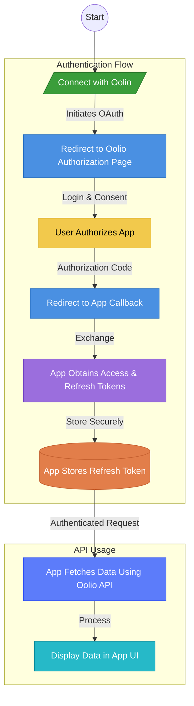

# developer-example

Example app to demonstrate how to use the developer platform.

- **Connect**: Authorize your app to access the user's data using OAuth2.
- **Oolio API Integration**: Fetch and display data from the Oolio API.



**Tech Stack:**

- **Server** Express.js
- **Client** React.js (Vite)
- **Database** In memory (for demo purposes)
- **Authentication** [oauth4webapi ](https://github.com/panva/oauth4webapi)

## Getting Started

1. Clone the repository:
   ```bash
   git clone
   cd developer-example
    ```
2. Install dependencies:
    ```bash
    bun install
    ```
3. Set up environment variables:
    - Create a `.env` file in the root directory.
    - Add the following variables:
      ```bash
      cp .env.example .env
      ```
    - Add your Oolio API credentials:
      ```env
      OOLIO_CLIENT_ID=your_client_id
      OOLIO_CLIENT_SECRET=your_client_secret
      ```
4. Start the server:
    ```bash
    docker compose up
    ```
5. Open your browser and navigate to `http://localhost:3000`.
6. Click the "Connect with Oolio" button to authorize your app.
7. After authorization, you will be redirected back to your app, and the Oolio API data will be displayed.

## Folder Structure

```
├── client
│   ├── public
│   └── src
│       ├── assets
│       ├── components
│       ├── services
│       └── types
└── server
    └── src
        ├── config
        ├── controllers
        ├── middleware
        ├── models
        └── routes
````
